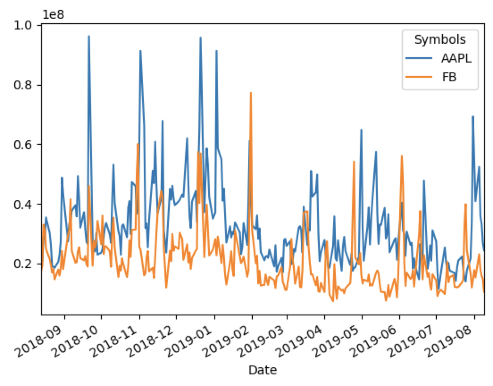

# Description
This is a simple python script that is deliberately minimal. It is light enough to be extensible and build upon even for new developers with minimal familiarity with scripting.

Out of the box, `stockmonitor` provides a utility script that takes one or more user-specified stock symbol (such as `FB`, `GOOGL`, `['FB', 'AAPL']`), and:
1. Fetches stock data from Yahoo and put them in a nice table using pandas 
2. Renders the last 7 days of stock performance for the specified stock(s)
3. Renders a line plot of the trading volume over the last 1 year for the specified stock(s)

### Education-oriented
- The script is only 20 lines long(!)
- Deliberately lightweight, to keep it extensible for new developers
- If you need help: reach out to me by email or open an issue.

### Demo Usage
- `python monitor.py FB `
    Renders:
    ```
                        High         Low        Open       Close    Volume   Adj Close
    Date                                                                            
    2019-08-01  198.470001  190.880005  194.169998  192.729996  17777000  192.729996
    2019-08-02  192.619995  188.070007  191.100006  189.020004  15297000  189.020004
    2019-08-05  185.669998  179.339996  184.690002  181.729996  23086700  181.729996
    2019-08-06  185.789993  183.089996  183.690002  184.509995  18035700  184.509995
    2019-08-07  186.369995  181.220001  183.600006  185.149994  15833200  185.149994
    2019-08-08  190.339996  184.050003  186.619995  190.160004  14828900  190.160004
    2019-08-09  190.979996  187.119995  190.000000  187.850006  10507300  187.850006
    ```

- `python monitor.py '[AAPL, FB]'`
    Renders:
    ```
        Attributes        High                     Low  ...      Volume   Adj Close            
    Symbols           AAPL          FB        AAPL  ...          FB        AAPL          FB
    Date                                            ...                                    
    2019-08-01  218.029999  198.470001  206.740005  ...  17777000.0  207.641068  192.729996
    2019-08-02  206.429993  192.619995  201.630005  ...  15297000.0  203.247772  189.020004
    2019-08-05  198.649994  185.669998  192.580002  ...  23086700.0  192.608185  181.729996
    2019-08-06  198.070007  185.789993  194.039993  ...  18035700.0  196.254333  184.509995
    2019-08-07  199.559998  186.369995  193.820007  ...  15833200.0  198.286606  185.149994
    2019-08-08  203.529999  190.339996  199.389999  ...  14828900.0  202.659988  190.160004
    2019-08-09  202.759995  190.979996  199.289993  ...  10507300.0  200.990005  187.850006
    ```

If TKInter is installed, it also renders a line chart using one or more of the columns. By default, it renders the `Volume` column but can be specified:
    


Other Example Usage:
- `python monitor.py GOOGL Close`
- `python monitor.py FB "['Close', 'Open']"`
- `python monitor.py --symbol=AAPL --plot=Low` (explicit flags)
- `python monitor.py --help` for documentation

## Installation
1. Download or Clone this repository
2. Navigate to the directory where you downloaded this repository  
3. Run: `pip install -r requirements.txt` to install the dependencies
4. After successful installation, run one of the sample code from the **Demo Usage** section.

## Dependencies
- Pandas
- Matplotlib
- Python Fire

